# Moderna Challenge for WISER Summer Program 2026
author: Sergey Grigorovich

### 1. Introduction and problem statement

mRNA can fold on itself when complementary nucleotides form base pairs, with the resulting secondary structure influencing stability, translation, and manufacturing. Predicting these structures is relevant to mRNA study and design.

Classical tools such as ViennaRNA predict low-energy RNA structures using thermodynamic models. In this project, ViennaRNA provides a reference structure and energy for quantum model comparison. The goal is not to replace this approach, but to study how RNA folding can be represented in a quantum optimization problem.

#### IBM-Moderna studies of mRNA folding (selected)
Recent IBM–Moderna research provides a clear progression toward larger and more hybrid quantum workflows.
- *Alevras et al. (2024)* represented RNA folding as a binary optimization problem and executed a variational algorithm on IBM quantum processors. It is a clear demonstation that larger RNA optimization models could be studied on current hardware rather than only through small simulations.

- *Kumar, Alevras, Metkar et al. (2025)* extended this direction through a broader hybrid workflow. The approach combined quantum execution with classical transformations, and local optimization to address larger RNA sequences.

- *Friedhoff, Metkar, Davis, Kumar, and Galda (2026)* focused on two remaining barriers: the number of qubits required and the difficulty of decoding dense, highly constrained optimization problems. Their compressed encoding and problem-aware decoder moved responsibility into a classical postprocessing stage, showing that the representation of constraints is as important as the algorithm itself.

#### The present project 
The present project continues the direction of these studies by asking a question about the role of structural constraints. Encoding **every** constraint directly in the quantum objective may produce more valid structures, but it adds multiple interactions and can make circuits **more demanding** by increasing depth. Leaving some constraints outside can simplify the circuit, but then invalid selections must be corrected classically, wuth rapidly growing computational cost.

The project asks a question about the **trade-off** through three versions of the RNA stem-selection problem:
- the **strict** variant places both nucleotide-overlap and crossing-stem constraints inside the QUBO;
- the **relaxed** variant keeps overlap constraints in the QUBO but handles crossings after sampling;
- the **postprocessed** variant uses the simplest quantum objective and leaves both conflict types to classical repair.

All three versions use the same RNA sequences, candidate stems, stem rewards, quantum workflow, repair logic, and ViennaRNA evaluation. The main difference is **where** structural conflicts are resolved. This design allows the project to compare quantum resource requirements, raw structural validity, dependence on classical repair, and agreement with the ViennaRNA.

This project is not expected to purpose a better or universal replacement for classical RNA-folding software. It explores **whether stricter quantum constraint encoding provides enough practical benefit to justify its additional circuit cost, or whether a simpler hybrid strategy offers a better balance for current quantum hardware**.

### 2. Data, simulations and hardware

The project relies on synthetic segments of RNA sequences, produced by concatenating real sequences from the BEACON dataset (*Ren, Yuchen, et al., 2024*) noncoding-RNA task and dividing them into target lengths. This approach preserves some balance between biological reality and the need for short, fixed-lenght sequences for testing and scaling comparisons.

Сompleted 1,170 successful variant–sequence runs: **630 Aer simulator** runs and **540 IBM hardware** runs:
- The simulator experiment covered **30 sequences** at each of 7 lengths `10, 12, 14, 16, 18, 19, 20` nucleotides, with all three variants.
- The hardware experiment covered **15 sequences** at each of 12 lengths `10, 15, 20, 25, 30, 35, 37, 40, 41, 42, 43, 44` nucleotides, with all three variants. 

Simulation and optimization were performed on Google Colab virtual machine (Intel Xeon CPU ~2.20 GHz). Simulation runs took **~14 minutes real-time** execution.

Hardware runs were executed circuits with up to **143** logical qubits on the **156-qubit** `ibm_quebec` backend. Recorded **QPU usage** reached **~28 minutes**. However, with transpilation, data transfer, results retrieval, with no other pendig jobs and queues, total execution time reached **~2.2 hours real-time**.

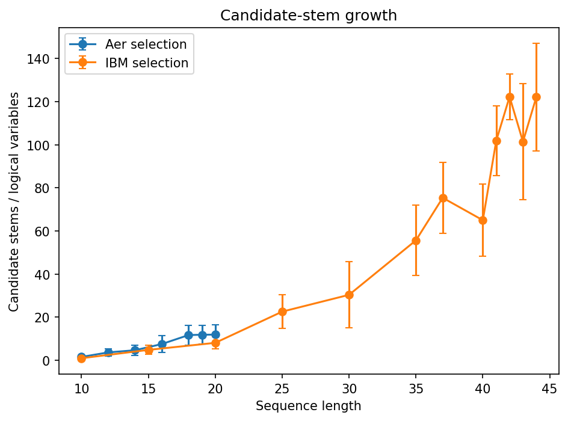 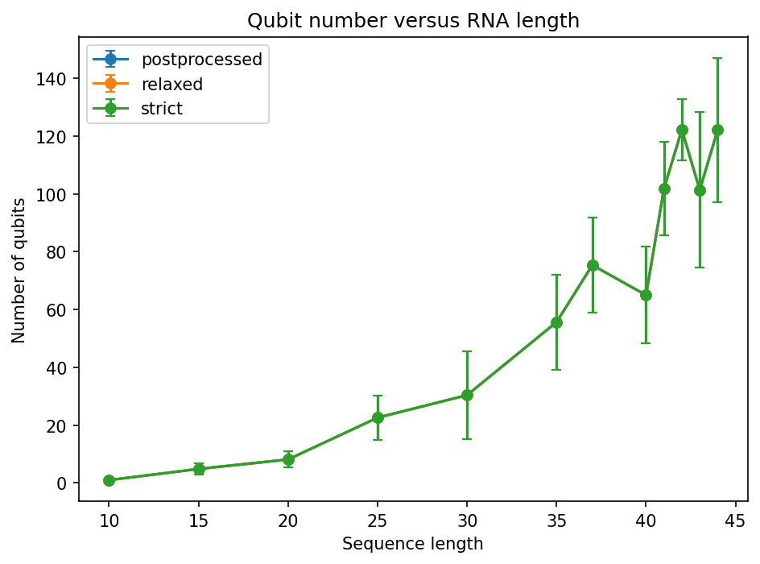

### 3. Results

The experiments show a clear trade-off between quantum constraint encoding and classical repair.
Compared with *strict* encoding, the *relaxed* variant **reduced the mean number of quadratic interactions by 37%** on average, across various sequence lenghts, and **reduced mean circuit depth by 21.3%**. The paired comparison showed lower *relaxed*-circuit depth at every tested nontrivial sequence length.

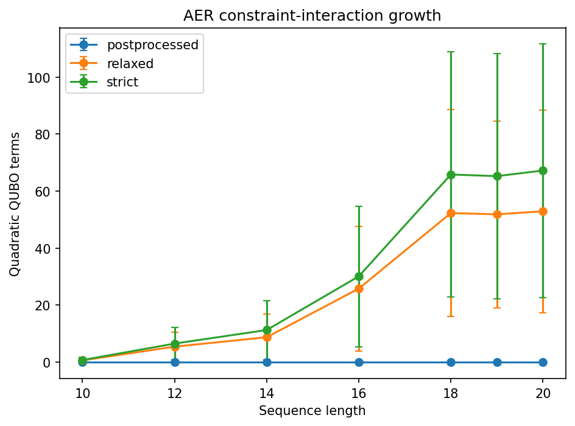 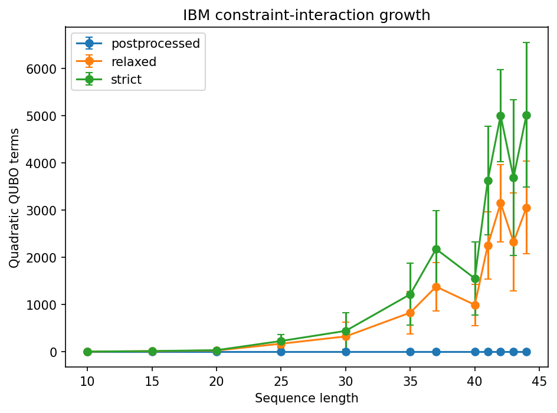
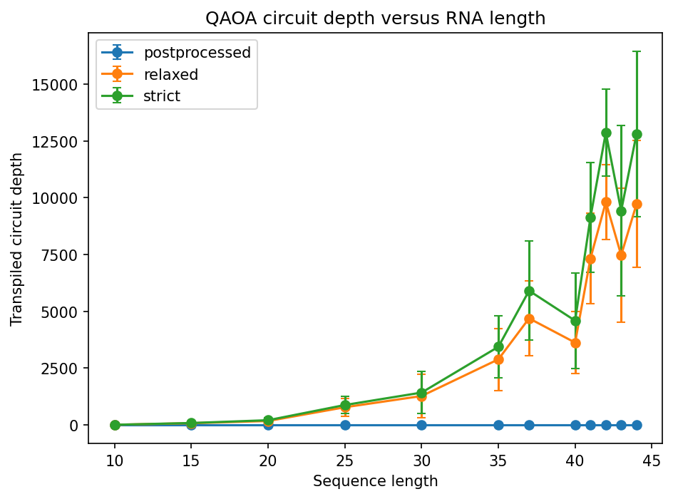 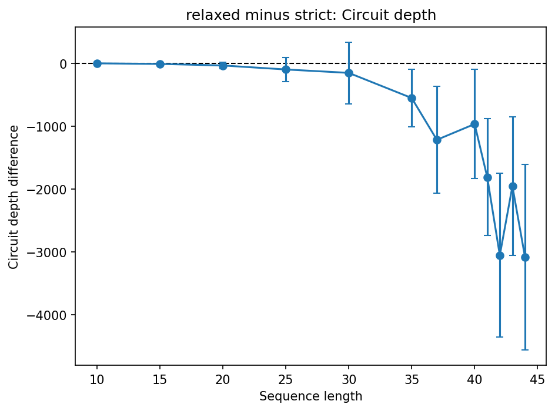

This reduction **did not worsen** repaired candidate **quality** substantially. The mean ViennaRNA energy gap was **0.443 kcal/mol** for *relaxed* and **0.475 kcal/mol** for *strict*. Mean base-pair F1 was **0.801 and 0.811**, respectively. *Strict* encoding improved raw validity on shorter instances, but this advantage disappeared as problem size increased, especially, from length 35 onward.

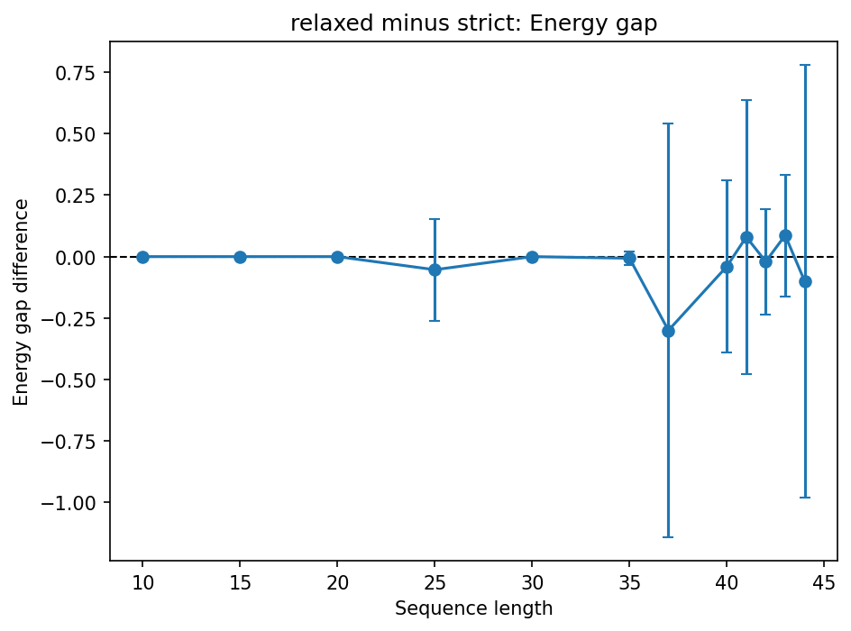 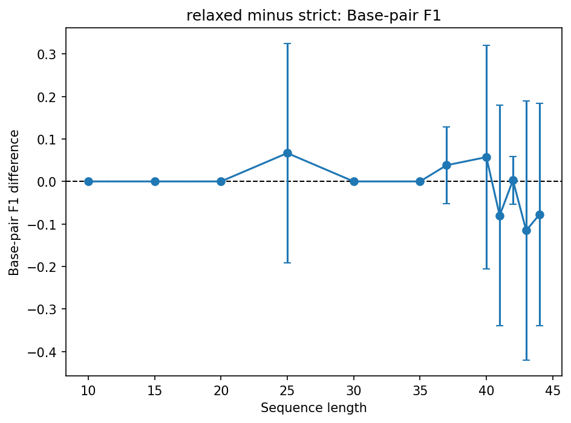
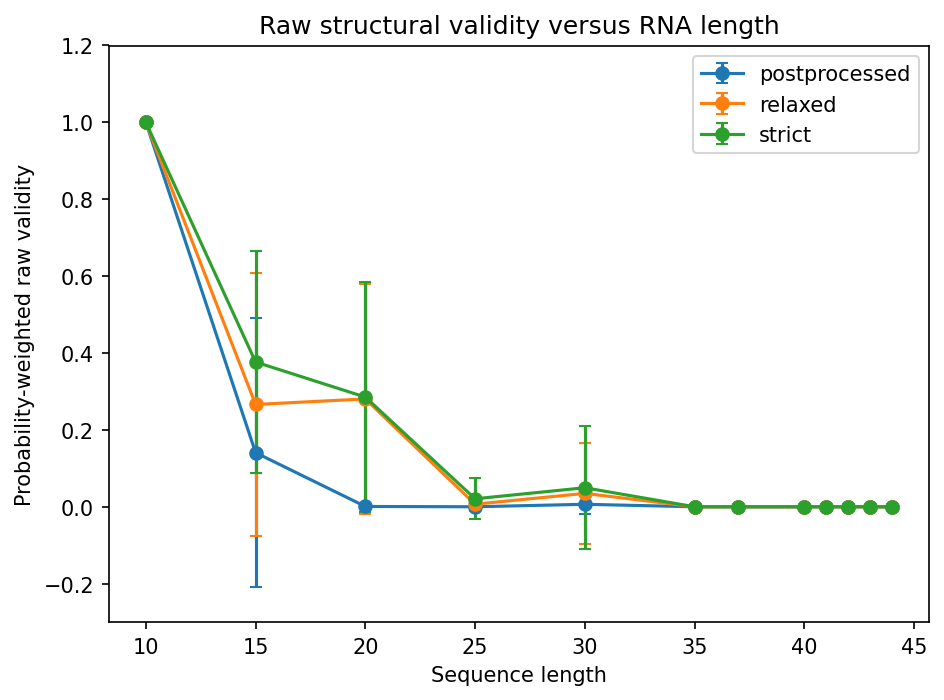 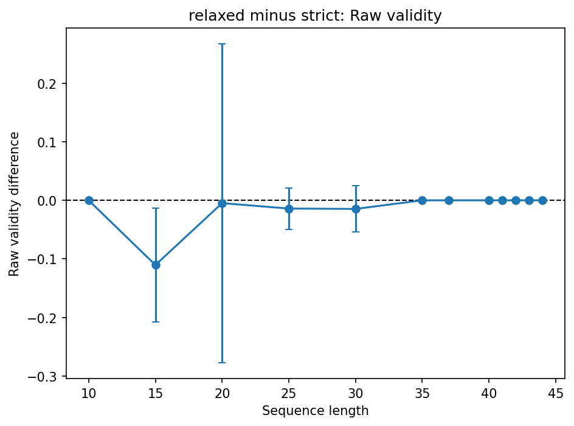

The *postprocessed* variant **minimized circuit cost**, with depth remaining near 6, but lead to **much more work for classical repair**. It required **48.91** stem removals on average, compared with **22.50** for *relaxed*, a 117% increase. Mean energy gap vs *relaxed* was also about **3.5 times larger**, **1.546** versus **0.443** kcal/mol, while mean F1 fell from **0.801** to **0.571**.

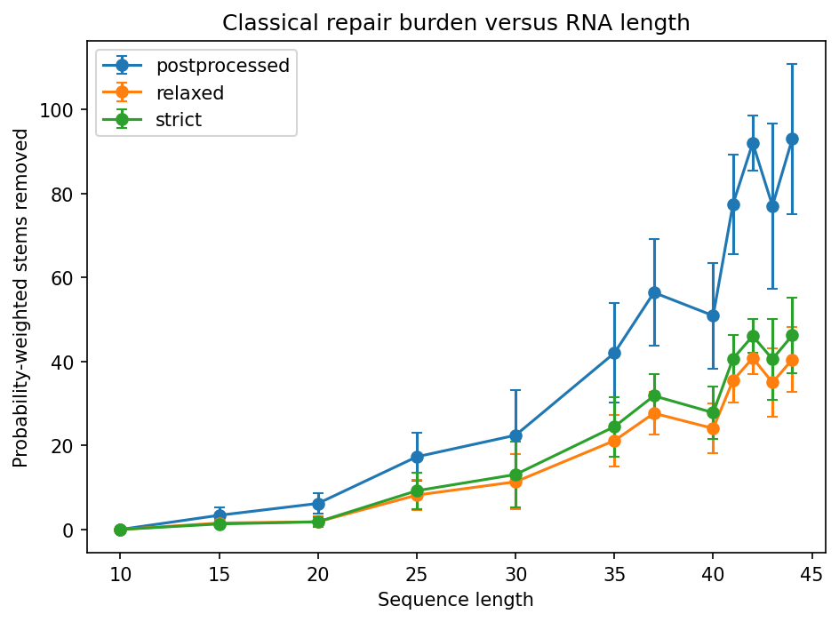 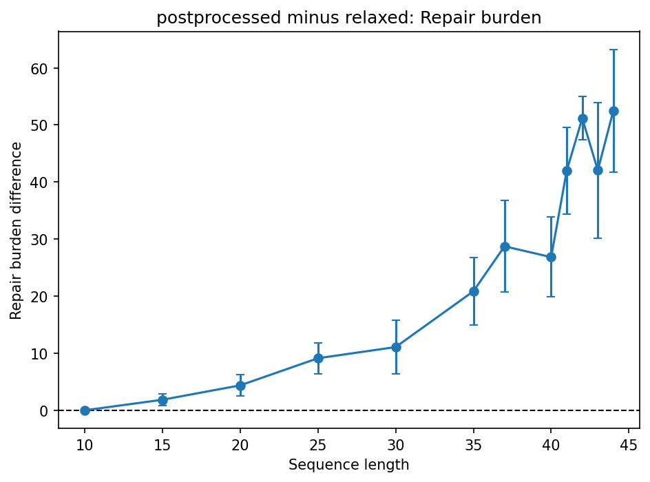
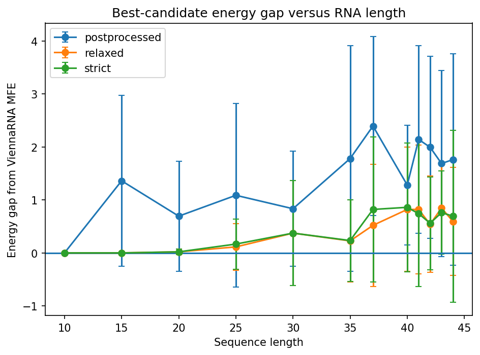 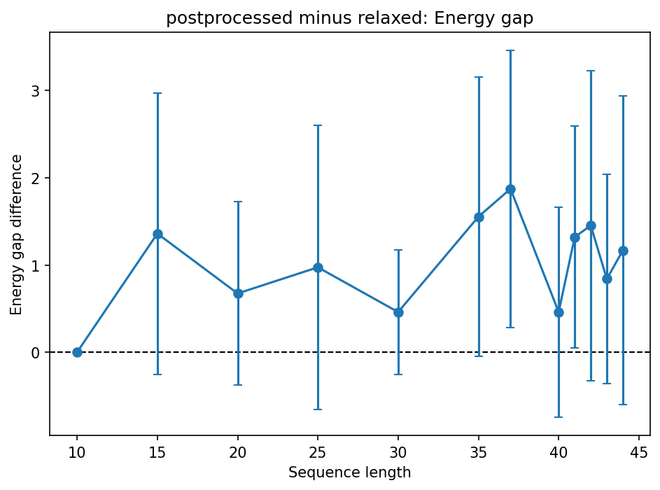

For more details, check **analysis notebook** (link).

#### Key summary

Overall, these results demonstrate that the *relaxed* variant provided **the best balance** among the tested strategies. It substantially **reduced QUBO connectivity and circuit depth** relative to *strict* encoding while **preserving similar repaired quality**.

*placeholder: link to presentation/video*

### 4. Project workflow

*placeholder: image of workflow chart*

- The workflow begins by loading BEACON source sequences and generating synthetic ones from segments of fixed lengths.
- ViennaRNA is used to calculate an MFE reference. 
- Candidate stems are sorted, enumerated, conflicts are identified, and strict, relaxed, and postprocessed QUBOs are constructed.
- QAOA parameters are optimized on Aer for the simulation experiment. 
- Run the simulation experiments and collect bitstrings.
- Hardware runs use fixed parameters obtained either through full Aer optimization (for sequences 10-20 length) or transferred from the most similar simulated sequence (20+ nucleotides).
- All measured bitstrings are decoded, invalid stems are repaired, and the results are evaluated on validity, repair burden, MFE energy gap, QUBO complexity, circuit resources and runtime.
- Execution results are saved as tables and processed separately in the analysis notebook.

For more details, check **execution notebook** (link).

#### Modules

Modules provide functions for execution and analysis notebooks:

`data.py`: loading BEACON data, generation of fixed-length synthetic sequences, ViennaRNA reference structures and energies, preparation of the processed sequence table

`model.py` enumeration of candidate stems, overlap and crossing conflicts, construction of the *strict*, *relaxed*, and *postprocessed* QUBO versions

`quantum.py` solver, Aer QAOA optimization and sampling, IBM backend preparation and sampling

`analysis.py` decoding solver outputs, structural repair, evaluation of repaired structures, aggregation of results, plotting and summary utilities

### 5. Limitations

- Sequences are synthetic segments created from concatenated BEACON sequences
- MFE reference is based on ViennaRNA, rather than experimental ground truth
- Basic hardware-aware optimization
- No advanced encoding/transpilation
- No error correction techniques
- The QUBO rewards stem length and does not implement a thermodynamic energy model
- Internal loops and other structural features are not represented directly
- Predictions do not include pseudoknots
- Noise-less simulations
- Shallow QAOA with p = 1 and limited classical optimization budgets
- Transferred parameters for longer sequences for hardware runs
- Biased sequence selection for manageable candidate-stem counts (inflation of reported sequence lenght)
- Hardware results come from one backend and limited repetitions, no generalization

### 6. References
1. Alevras, Dimitris, et al. "mRNA secondary structure prediction using utility-scale quantum computers." 2024 IEEE International Conference on Quantum Computing and Engineering (QCE). Vol. 1. IEEE, 2024.
2. Kumar, Vaibhaw, et al. "Towards secondary structure prediction of longer mrna sequences using a quantum-centric optimization scheme." 2025 IEEE International Conference on Quantum Computing and Engineering (QCE). Vol. 1. IEEE, 2025.
3. Friedhoff, Triet, et al. "Pauli Correlation Encoding for mRNA Secondary Structure Prediction: Problem-Aware Decoding for Dense-Constraint QUBOs." arXiv preprint arXiv:2605.20163 (2026).
4. Ren, Yuchen, et al. "Beacon: Benchmark for comprehensive rna tasks and language models." Advances in Neural Information Processing Systems 37 (2024): 92891-92921.
